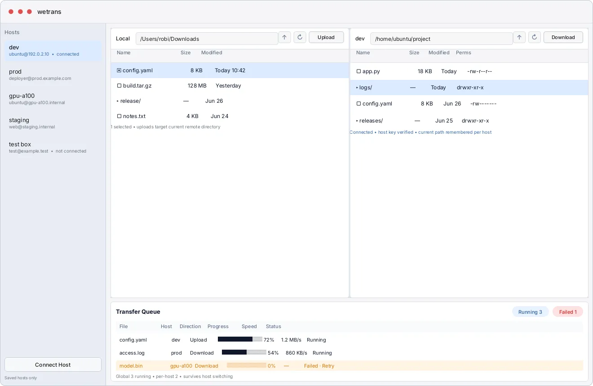
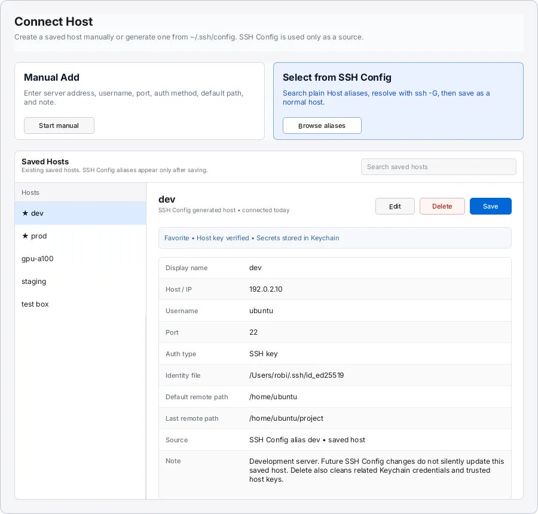

# wetrans

wetrans is a native macOS SSH/SFTP remote file manager for people who move files between a Mac and remote Linux hosts.

It keeps the daily workflow close to Finder: pick a saved host, browse local and remote directories side by side, then upload or download selected files through a visible transfer queue.

## Screenshots

### Main Browser



### Connect Host



_Screenshots from the current ardot MVP prototype._

## What It Does

- Browse local files and remote SFTP directories in a three-pane macOS layout.
- Save hosts manually or generate saved hosts from `~/.ssh/config`.
- Treat SSH Config as an import source only; saved hosts become normal wetrans hosts.
- Store host metadata locally while keeping passwords and key passphrases in macOS Keychain.
- Verify and persist trusted host keys without modifying OpenSSH `known_hosts`.
- Upload and download files and directories through a global transfer queue with bounded concurrency.
- Support single-click selection by default, with Shift-click multi-selection for batch transfers.
- Provide desktop-style row actions such as upload, download, reveal in Finder, copy remote path, and retry/remove transfer tasks.

## Current Status

wetrans is in MVP development. The current implementation is SwiftPM-first and targets native macOS distribution outside the Mac App Store during early internal testing.

The MVP intentionally focuses on direct SSH/SFTP file management. Advanced SSH runtime features such as ProxyJump, complex ProxyCommand, SSH Agent integration, keyboard-interactive auth, drag-and-drop, directory sync, and resumable transfers are outside the first slice.

## Design Source

The UI direction comes from the ardot MVP prototype:

```text
cocraft://localhost/file/697398357828482?node_id=0%3A1
```

The target feel is macOS-native: Finder-like host navigation, dense SwiftUI file panels with narrow AppKit desktop integrations, restrained controls, and a bottom transfer queue that stays visible while browsing.

## Local Development

Requirements:

- macOS
- Swift toolchain
- `libssh2` for real SSH/SFTP runtime work

Install the SFTP runtime dependency:

```bash
brew install libssh2
```

Set up and verify the project:

```bash
scripts/setup
scripts/verify
```

Common commands:

```bash
swift build
swift test
scripts/e2e
swift run wetrans
```

Package for internal testing:

```bash
scripts/package
```

The packaging script always creates `dist/wetrans.app` and `dist/wetrans.zip`. It bundles libssh2 and OpenSSL runtime libraries into the app so testers do not need Homebrew. Without credentials it applies an ad-hoc local signature for validation, then skips Developer ID signing and notarization. Provide credentials for a distributable signed and notarized build:

```bash
WETRANS_DEVELOPER_ID_APPLICATION="Developer ID Application: Example (TEAMID)" \
WETRANS_NOTARYTOOL_PROFILE="wetrans-notary" \
scripts/package
```

The default E2E path runs local Docker OpenSSH-backed SFTP checks and app smoke verification. It requires local libssh2 support plus Docker CLI/daemon access, but it does not require a public SFTP host or personal SSH key:

```bash
scripts/e2e
```

`scripts/e2e` first starts a temporary local OpenSSH container, runs `RemoteFileSystemRealHostIntegrationTests` for connect/list, upload, and download coverage using key and password authentication, then launches the packaged app and checks the main UI accessibility anchors. The fixture uses `lscr.io/linuxserver/openssh-server:latest` by default, so Docker must be able to pull and run that image. To use a mirror or pinned image, set `WETRANS_SFTP_DOCKER_IMAGE` before running the script:

```bash
WETRANS_SFTP_DOCKER_IMAGE="lscr.io/linuxserver/openssh-server:latest" scripts/e2e
```

Full UI scenarios remain opt-in with `WETRANS_E2E_RUN_FULL=1`.

See [`docs/real-host-sftp-smoke.md`](docs/real-host-sftp-smoke.md) for SFTP E2E notes, local Docker fixture behavior, external override config format, and secret handling rules.

## Project Docs

Detailed product and engineering docs live under [`docs/`](docs/README.md), including the PRD, architecture design, data model, technical selection, and focused Superpowers specs.
